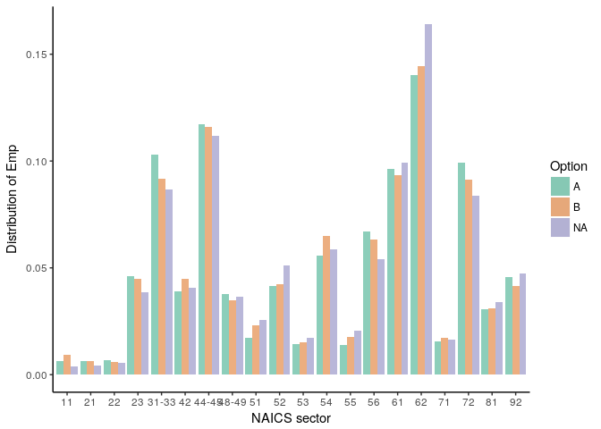

# Snapshot S2014 availability
Lars Vilhuber  

Users of the LEHD data in the Federal Statistical Research Data Centers (FSRDC) can only access data from states that have granted  non-Census researchers access to the data. There are, in short, two options that a state can choose: the state can delegate the approval process to the Census Bureau, which will grant access to qualified researchers on qualified research projects (option A); or it can itself review and approve projects that are submitted through the FSRDC project system (option B). Thus, researchers will automatically get access to states with option A if their project is approved by the Census Bureau, and may later obtain access to states' data that chose option B. 


We obtained a list of the state of the MOUs as of 

> **09-08-2017.** 

There are still a few states at this time that have an older form of the MOU, and for which we cannot easily deduce the option chosen. Here, we will use the later versions (version 2) that have selected "Option A".


Of the 51 states with a MOU on file as of 09-08-2017 with the Census Bureau, 12 have chosen Option A:

Option    Freq
-------  -----
A           12
B           32
NA           7

# Missing Completely at Random
While the number of states that have not agreed to Option A may seem small, from a statistical point of view, they have one important feature: the decision to participate ($M$) is (most likely) not correlated with any observable characteristic ($Y$) of the non-participating state (Statistical Analysis with Missing Data, 2nd edition, Roderick J. A. Little and Donald B. Rubin, New York: John Wiley & Sons, 2002):

> $p(M | Y, \theta, \psi) = p(M|\psi)$

where $\theta$ are parameters associated with the data generating process, and $\psi$ are parameters associated with the decision to participate in Option A. 

# Comparing sets of states
To assess the claim, we are going to use public-use QWI data, drawn from http://lehd.ces.census.gov/pub/, to assess how comparable the set of states having chosen Option A are, compared to the remaining states, based on a variety of variables available.

> Users who wish to consider different variables than the ones we show here should feel free to [clone this git repository](https://github.com/larsvilhuber/snapshot-availability), and change parameters of interest, or access our [interactive webpage](https://www.ncrn.cornell.edu/d/LEHD_Snapshot/).

# Parameters


```r
# common quarter to look at
# this could be deduced from metadata, here we hard-code it
qwivintage <- "latest_release"
qwiyear    <- 2014
qwiquarter <- 1
# Read the version file
version.url <- url(paste(urlbase,"ak",qwivintage,"DVD-sa_f","version_sa_f.txt",sep="/"))
version <- read.csv(version.url,header = FALSE,sep = "",as.is = TRUE)
names(version) <- c("type","state","fips","range","schema","release","vintage")
write.csv(x = version[,c("type","schema","release")],file="metadata.csv")
```

# Some Technical Stuff

We first define (source) a function '[download_qwi.R](download_qwi.R)' to download and subset QWI CSV files.

```r
source("download_qwi.R",echo = TRUE)
```

```
## 
## > download_qwi <- function(state, qyear = NA, qquarter = NA) {
## +     qwifile <- paste("qwi", tolower(state), "sa_f_gs_ns_oslp_u", 
## +         sep = "_" .... [TRUNCATED]
```
We then cycle through all the states and download the relevant file. 

```r
download.date <- Sys.Date()
time.qwi <- system.time(for (x in qwistates) { 
  eval(parse(text=paste("qwi_",tolower(x)," <- download_qwi(\"",x,"\")",sep = "")))
  })
```
The above code can take a while, in this example and on my computer, it ran for 24 minutes on 2017-09-10.

Now that we have the files, we collate them all into a single file:

```r
for (x in qwistates) { eval(parse(text=paste("qwi_",tolower(x),"$state = \"",x,"\"",sep = "")))}
for (x in qwistates[1]) { eval(parse(text=paste("all <- qwi_",tolower(x),sep = "")))}
for (x in qwistates[-1]) { eval(parse(text=paste("all <- rbind(all,qwi_",tolower(x),")",sep = "")))}
```
and merge on the indicators for MOU status:

```r
allmous <- merge(all,mous,by.x="geography",by.y = "fips",all.x = TRUE)
size <- allmous[allmous$ind_level=="A",]
industry <- allmous[allmous$industry != "00",]
save(industry,file="industry.Rdata")
save(all,file="all_qwi.Rdata")
write.csv(x = industry,file="LEHD_Snapshot/qwi_industry_extract.csv")
```

> Users who want to consider different variables might change the following option:


```r
qwi_names=names(industry)[17:48]
usevar <- qwi_names[1]
industry <- subset(industry, year==qwiyear & quarter==qwiquarter)
```
# Results
## Emp
The following results were based on data for 2014Q1, downloaded on 2017-09-10, at which point at least one of the downloaded states was from release R2017Q2 (we downloaded from 'latest_release'). 

> An interactive version of these graphs can be found at https://www.ncrn.cornell.edu/d/LEHD_Snapshot/.  

The industry distribution of **Emp** by chosen option thus looks like this:
<!-- -->


# weights:  3 (2 variable)
initial  value 705.623830 
iter  10 value 539.399565
iter  10 value 539.399565
iter  10 value 539.399565
final  value 539.399565 
converged

<table style="text-align:center"><caption><strong>Test of MCAR for `Emp` (conditional on mapping `NA` into `B`)</strong></caption>
<tr><td colspan="2" style="border-bottom: 1px solid black"></td></tr><tr><td style="text-align:left"></td><td>Option</td></tr>
<tr><td colspan="2" style="border-bottom: 1px solid black"></td></tr><tr><td style="text-align:left">Constant</td><td>0.888<sup>***</sup></td></tr>
<tr><td style="text-align:left"></td><td>(0.094)</td></tr>
<tr><td style="text-align:left"></td><td></td></tr>
<tr><td style="text-align:left">Emp</td><td>0.295<sup>***</sup></td></tr>
<tr><td style="text-align:left"></td><td>(0.068)</td></tr>
<tr><td style="text-align:left"></td><td></td></tr>
<tr><td style="text-align:left">Akaike Inf. Crit.</td><td>1,082.799</td></tr>
<tr><td colspan="2" style="border-bottom: 1px solid black"></td></tr><tr><td style="text-align:left"><em>Notes:</em></td><td style="text-align:right"><sup>***</sup>Significant at the 1 percent level.</td></tr>
<tr><td style="text-align:left"></td><td style="text-align:right"><sup>**</sup>Significant at the 5 percent level.</td></tr>
<tr><td style="text-align:left"></td><td style="text-align:right"><sup>*</sup>Significant at the 10 percent level.</td></tr>
</table>


## SepBeg

For the industry distribution of **SepBeg**, the distribution looks like this:

<!-- -->
# weights:  3 (2 variable)
initial  value 705.623830 
iter  10 value 544.536674
iter  10 value 544.536674
iter  10 value 544.536674
final  value 544.536674 
converged

<table style="text-align:center"><caption><strong>Test of MCAR for `SepBeg` (conditional on mapping `NA` into `B`)</strong></caption>
<tr><td colspan="2" style="border-bottom: 1px solid black"></td></tr><tr><td style="text-align:left"></td><td>Option</td></tr>
<tr><td colspan="2" style="border-bottom: 1px solid black"></td></tr><tr><td style="text-align:left">Constant</td><td>0.979<sup>***</sup></td></tr>
<tr><td style="text-align:left"></td><td>(0.089)</td></tr>
<tr><td style="text-align:left"></td><td></td></tr>
<tr><td style="text-align:left">SepBeg</td><td>0.204<sup>***</sup></td></tr>
<tr><td style="text-align:left"></td><td>(0.058)</td></tr>
<tr><td style="text-align:left"></td><td></td></tr>
<tr><td style="text-align:left">Akaike Inf. Crit.</td><td>1,093.073</td></tr>
<tr><td colspan="2" style="border-bottom: 1px solid black"></td></tr><tr><td style="text-align:left"><em>Notes:</em></td><td style="text-align:right"><sup>***</sup>Significant at the 1 percent level.</td></tr>
<tr><td style="text-align:left"></td><td style="text-align:right"><sup>**</sup>Significant at the 5 percent level.</td></tr>
<tr><td style="text-align:left"></td><td style="text-align:right"><sup>*</sup>Significant at the 10 percent level.</td></tr>
</table>

## Putting both variables in the same model
If we use both these two variables in the same MCAR model, we obtain the following:
# weights:  4 (3 variable)
initial  value 705.623830 
iter  10 value 539.041576
final  value 538.896265 
converged

<table style="text-align:center"><caption><strong>Test of MCAR for Emp+`SepBeg` (conditional on mapping `NA` into `B`)</strong></caption>
<tr><td colspan="2" style="border-bottom: 1px solid black"></td></tr><tr><td style="text-align:left"></td><td>Option</td></tr>
<tr><td colspan="2" style="border-bottom: 1px solid black"></td></tr><tr><td style="text-align:left">Constant</td><td>0.884<sup>***</sup></td></tr>
<tr><td style="text-align:left"></td><td>(0.094)</td></tr>
<tr><td style="text-align:left"></td><td></td></tr>
<tr><td style="text-align:left">Emp</td><td>0.403<sup>***</sup></td></tr>
<tr><td style="text-align:left"></td><td>(0.130)</td></tr>
<tr><td style="text-align:left"></td><td></td></tr>
<tr><td style="text-align:left">SepBeg</td><td>-0.104</td></tr>
<tr><td style="text-align:left"></td><td>(0.101)</td></tr>
<tr><td style="text-align:left"></td><td></td></tr>
<tr><td style="text-align:left">Akaike Inf. Crit.</td><td>1,083.793</td></tr>
<tr><td colspan="2" style="border-bottom: 1px solid black"></td></tr><tr><td style="text-align:left"><em>Notes:</em></td><td style="text-align:right"><sup>***</sup>Significant at the 1 percent level.</td></tr>
<tr><td style="text-align:left"></td><td style="text-align:right"><sup>**</sup>Significant at the 5 percent level.</td></tr>
<tr><td style="text-align:left"></td><td style="text-align:right"><sup>*</sup>Significant at the 10 percent level.</td></tr>
</table>


## Payroll

For the industry distribution of **Payroll**, the distribution looks like this:
<!-- -->
# weights:  3 (2 variable)
initial  value 705.623830 
iter  10 value 536.439672
final  value 536.439626 
converged

<table style="text-align:center"><caption><strong>Test of MCAR for `Payroll` (conditional on mapping `NA` into `B`)</strong></caption>
<tr><td colspan="2" style="border-bottom: 1px solid black"></td></tr><tr><td style="text-align:left"></td><td>Option</td></tr>
<tr><td colspan="2" style="border-bottom: 1px solid black"></td></tr><tr><td style="text-align:left">Constant</td><td>0.870<sup>***</sup></td></tr>
<tr><td style="text-align:left"></td><td>(0.093)</td></tr>
<tr><td style="text-align:left"></td><td></td></tr>
<tr><td style="text-align:left">Payroll</td><td>0.253<sup>***</sup></td></tr>
<tr><td style="text-align:left"></td><td>(0.055)</td></tr>
<tr><td style="text-align:left"></td><td></td></tr>
<tr><td style="text-align:left">Akaike Inf. Crit.</td><td>1,076.879</td></tr>
<tr><td colspan="2" style="border-bottom: 1px solid black"></td></tr><tr><td style="text-align:left"><em>Notes:</em></td><td style="text-align:right"><sup>***</sup>Significant at the 1 percent level.</td></tr>
<tr><td style="text-align:left"></td><td style="text-align:right"><sup>**</sup>Significant at the 5 percent level.</td></tr>
<tr><td style="text-align:left"></td><td style="text-align:right"><sup>*</sup>Significant at the 10 percent level.</td></tr>
</table>

Additional variables (see the [http://lehd.ces.census.gov/data/schema/V4.0.4/lehd_public_use_schema.html](LEHD Schema) for names) can be easily added to the Rmd source file.

# Appendix: Full list of state MOUs and option chosen as of 09-08-2017

 fips  Abbr   Name                   Option 
-----  -----  ---------------------  -------
    1  AL     Alabama                B      
    2  AK     Alaska                 NA     
    4  AZ     Arizona                A      
    5  AR     Arkansas               A      
    6  CA     California             B      
    8  CO     Colorado               B      
    9  CT     Connecticut            B      
   10  DE     Delaware               A      
   11  DC     District of Columbia   A      
   12  FL     Florida                B      
   13  GA     Georgia                B      
   15  HI     Hawaii                 B      
   16  ID     Idaho                  B      
   17  IL     Illinois               B      
   18  IN     Indiana                A      
   19  IA     Iowa                   A      
   20  KS     Kansas                 A      
   21  KY     Kentucky               B      
   22  LA     Louisiana              B      
   23  ME     Maine                  A      
   24  MD     Maryland               A      
   25  MA     Massachusetts          B      
   26  MI     Michigan               B      
   27  MN     Minnesota              B      
   28  MS     Mississippi            NA     
   29  MO     Missouri               B      
   30  MT     Montana                B      
   31  NE     Nebraska               NA     
   32  NV     Nevada                 A      
   33  NH     New Hampshire          B      
   34  NJ     New Jersey             B      
   35  NM     New Mexico             B      
   36  NY     New York               NA     
   37  NC     North Carolina         B      
   38  ND     North Dakota           B      
   39  OH     Ohio                   NA     
   40  OK     Oklahoma               A      
   41  OR     Oregon                 B      
   42  PA     Pennsylvania           B      
   44  RI     Rhode Island           B      
   45  SC     South Carolina         B      
   46  SD     South Dakota           NA     
   47  TN     Tennessee              A      
   48  TX     Texas                  B      
   49  UT     Utah                   B      
   50  VT     Vermont                B      
   51  VA     Virginia               B      
   53  WA     Washington             B      
   54  WV     West Virginia          B      
   55  WI     Wisconsin              B      
   56  WY     Wyoming                NA     
